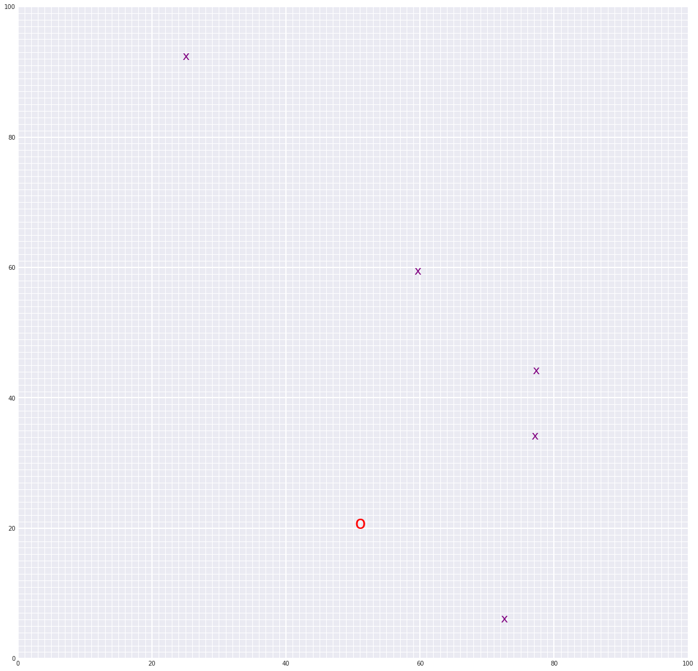

# Landmark Detection and Tracking (SLAM)

## Introduction
The goal of the project is to implement Graph SLAM for a 2 dimensional world.
A map of an environment is created from only sensor and motion data gathered by a robot, over time.
SLAM gives a way to track the location of a robot in the world in real-time and identify the locations of landmarks such as buildings, trees, rocks, and other world features.

## Example
The image demonstrate 2D world, robot pose and landmarks:

### <i>Last Pose: (51.04042166296247, 20.67422925739666)</i>
